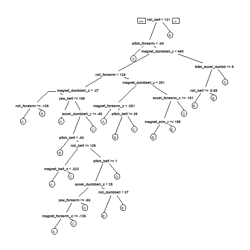

## Background

Using devices such as Jawbone Up, Nike FuelBand, and Fitbit it is now possible to collect a large amount of data about personal activity relatively inexpensively. These type of devices are part of the quantified self movement – a group of enthusiasts who take measurements about themselves regularly to improve their health, to find patterns in their behavior, or because they are tech geeks. One thing that people regularly do is quantify how much of a particular activity they do, but they rarely quantify how well they do it. 

In this project, your goal will be to use data from accelerometers on the belt, forearm, arm, and dumbell of 6 participants. They were asked to perform barbell lifts correctly and incorrectly in 5 different ways. More information is available from the website here: http://groupware.les.inf.puc-rio.br/har (see the section on the Weight Lifting Exercise Dataset).

## R Code

### Load Packages, set seed


```r
library(caret)
library(randomForest)
library(rpart)
library(rpart.plot)
library(rattle)
set.seed(5316)
```
### Download the data into the working directory


```r
getwd()
trainUrl <-"https://d396qusza40orc.cloudfront.net/predmachlearn/pml-training.csv"
testUrl <- "https://d396qusza40orc.cloudfront.net/predmachlearn/pml-testing.csv"
trainFile <- "./data/pml-training.csv"
testFile  <- "./data/pml-testing.csv"
if (!file.exists("./data")) {
  dir.create("./data")
}
if (!file.exists(trainFile)) {
  download.file(trainUrl, destfile=trainFile)
}
if (!file.exists(testFile)) {
  download.file(testUrl, destfile=testFile)
}
```
### Reading and Cleaning Data

Once the data is downloaded into a new data folder in the working directory, 
the files are read into data frames in R. We then check the dimensions of the datasets with `dim` and the variable names with `names`.


```r
trainDat <- read.csv("./data/pml-training.csv", na.strings = c("NA","#DIV/0!",""))
testDat <- read.csv("./data/pml-testing.csv", na.strings = c("NA","#DIV/0!",""))
dim(trainDat)
```

```
## [1] 19622   160
```

```r
dim(testDat)
```

```
## [1]  20 160
```

```r
names(trainDat)
```

```
##   [1] "X"                        "user_name"                "raw_timestamp_part_1"    
##   [4] "raw_timestamp_part_2"     "cvtd_timestamp"           "new_window"              
##   [7] "num_window"               "roll_belt"                "pitch_belt"              
##  [10] "yaw_belt"                 "total_accel_belt"         "kurtosis_roll_belt"      
##  [13] "kurtosis_picth_belt"      "kurtosis_yaw_belt"        "skewness_roll_belt"      
##  [16] "skewness_roll_belt.1"     "skewness_yaw_belt"        "max_roll_belt"           
##  [19] "max_picth_belt"           "max_yaw_belt"             "min_roll_belt"           
##  [22] "min_pitch_belt"           "min_yaw_belt"             "amplitude_roll_belt"     
##  [25] "amplitude_pitch_belt"     "amplitude_yaw_belt"       "var_total_accel_belt"    
##  [28] "avg_roll_belt"            "stddev_roll_belt"         "var_roll_belt"           
##  [31] "avg_pitch_belt"           "stddev_pitch_belt"        "var_pitch_belt"          
##  [34] "avg_yaw_belt"             "stddev_yaw_belt"          "var_yaw_belt"            
##  [37] "gyros_belt_x"             "gyros_belt_y"             "gyros_belt_z"            
##  [40] "accel_belt_x"             "accel_belt_y"             "accel_belt_z"            
##  [43] "magnet_belt_x"            "magnet_belt_y"            "magnet_belt_z"           
##  [46] "roll_arm"                 "pitch_arm"                "yaw_arm"                 
##  [49] "total_accel_arm"          "var_accel_arm"            "avg_roll_arm"            
##  [52] "stddev_roll_arm"          "var_roll_arm"             "avg_pitch_arm"           
##  [55] "stddev_pitch_arm"         "var_pitch_arm"            "avg_yaw_arm"             
##  [58] "stddev_yaw_arm"           "var_yaw_arm"              "gyros_arm_x"             
##  [61] "gyros_arm_y"              "gyros_arm_z"              "accel_arm_x"             
##  [64] "accel_arm_y"              "accel_arm_z"              "magnet_arm_x"            
##  [67] "magnet_arm_y"             "magnet_arm_z"             "kurtosis_roll_arm"       
##  [70] "kurtosis_picth_arm"       "kurtosis_yaw_arm"         "skewness_roll_arm"       
##  [73] "skewness_pitch_arm"       "skewness_yaw_arm"         "max_roll_arm"            
##  [76] "max_picth_arm"            "max_yaw_arm"              "min_roll_arm"            
##  [79] "min_pitch_arm"            "min_yaw_arm"              "amplitude_roll_arm"      
##  [82] "amplitude_pitch_arm"      "amplitude_yaw_arm"        "roll_dumbbell"           
##  [85] "pitch_dumbbell"           "yaw_dumbbell"             "kurtosis_roll_dumbbell"  
##  [88] "kurtosis_picth_dumbbell"  "kurtosis_yaw_dumbbell"    "skewness_roll_dumbbell"  
##  [91] "skewness_pitch_dumbbell"  "skewness_yaw_dumbbell"    "max_roll_dumbbell"       
##  [94] "max_picth_dumbbell"       "max_yaw_dumbbell"         "min_roll_dumbbell"       
##  [97] "min_pitch_dumbbell"       "min_yaw_dumbbell"         "amplitude_roll_dumbbell" 
## [100] "amplitude_pitch_dumbbell" "amplitude_yaw_dumbbell"   "total_accel_dumbbell"    
## [103] "var_accel_dumbbell"       "avg_roll_dumbbell"        "stddev_roll_dumbbell"    
## [106] "var_roll_dumbbell"        "avg_pitch_dumbbell"       "stddev_pitch_dumbbell"   
## [109] "var_pitch_dumbbell"       "avg_yaw_dumbbell"         "stddev_yaw_dumbbell"     
## [112] "var_yaw_dumbbell"         "gyros_dumbbell_x"         "gyros_dumbbell_y"        
## [115] "gyros_dumbbell_z"         "accel_dumbbell_x"         "accel_dumbbell_y"        
## [118] "accel_dumbbell_z"         "magnet_dumbbell_x"        "magnet_dumbbell_y"       
## [121] "magnet_dumbbell_z"        "roll_forearm"             "pitch_forearm"           
## [124] "yaw_forearm"              "kurtosis_roll_forearm"    "kurtosis_picth_forearm"  
## [127] "kurtosis_yaw_forearm"     "skewness_roll_forearm"    "skewness_pitch_forearm"  
## [130] "skewness_yaw_forearm"     "max_roll_forearm"         "max_picth_forearm"       
## [133] "max_yaw_forearm"          "min_roll_forearm"         "min_pitch_forearm"       
## [136] "min_yaw_forearm"          "amplitude_roll_forearm"   "amplitude_pitch_forearm" 
## [139] "amplitude_yaw_forearm"    "total_accel_forearm"      "var_accel_forearm"       
## [142] "avg_roll_forearm"         "stddev_roll_forearm"      "var_roll_forearm"        
## [145] "avg_pitch_forearm"        "stddev_pitch_forearm"     "var_pitch_forearm"       
## [148] "avg_yaw_forearm"          "stddev_yaw_forearm"       "var_yaw_forearm"         
## [151] "gyros_forearm_x"          "gyros_forearm_y"          "gyros_forearm_z"         
## [154] "accel_forearm_x"          "accel_forearm_y"          "accel_forearm_z"         
## [157] "magnet_forearm_x"         "magnet_forearm_y"         "magnet_forearm_z"        
## [160] "classe"
```
We want to remove variables with missing observations from the training set -- these can negatively impact the predictive modeling. We remove from the training and the test set variables that don't contain the relevant accelerometry data, just to tidy the dataframes. From the output from `names`, we see that these variables are in the first seven columns of the dataframe.


```r
trainDat <- trainDat[, colSums(is.na(trainDat)) == 0] 
testDat <- testDat[, colSums(is.na(testDat)) == 0]  
trainDat <- trainDat[, -c(1:7)]
testDat <- testDat[, -c(1:7)]
```
### Subsetting the training data

We have a large sample size, so we can split our training dataset into new "subtraining" and "subtesting" datasets, partitioning about 80% of the samples into the training set. 


```r
inTrain <- createDataPartition(trainDat$classe, p=0.8, list=FALSE)
newTraining = trainDat[ inTrain,]
newTesting = trainDat[-inTrain,]
```
### Model Building

Random forests are a robust method for classifying factor variables such as **classe**, the outcome variable, because of their efficiency at selecting the most important predictive variables and handling of covariates and outliers.

We first build the predictive model using our new subsetted training data.


```r
fitForest <- randomForest(classe ~., data=newTraining, type="class")
```
Then we test the fit on the testing subset of the training data and calculate the accuracy using `confusionMatrix`.


```r
resultForest <- predict(fitForest, newTesting)
confusionMatrix(newTesting$classe, resultForest)
```

```
## Confusion Matrix and Statistics
## 
##           Reference
## Prediction    A    B    C    D    E
##          A 1116    0    0    0    0
##          B    3  756    0    0    0
##          C    0    2  682    0    0
##          D    0    0    4  639    0
##          E    0    0    0    2  719
## 
## Overall Statistics
##                                          
##                Accuracy : 0.9972         
##                  95% CI : (0.995, 0.9986)
##     No Information Rate : 0.2852         
##     P-Value [Acc > NIR] : < 2.2e-16      
##                                          
##                   Kappa : 0.9965         
##                                          
##  Mcnemar's Test P-Value : NA             
## 
## Statistics by Class:
## 
##                      Class: A Class: B Class: C Class: D Class: E
## Sensitivity            0.9973   0.9974   0.9942   0.9969   1.0000
## Specificity            1.0000   0.9991   0.9994   0.9988   0.9994
## Pos Pred Value         1.0000   0.9960   0.9971   0.9938   0.9972
## Neg Pred Value         0.9989   0.9994   0.9988   0.9994   1.0000
## Prevalence             0.2852   0.1932   0.1749   0.1634   0.1833
## Detection Rate         0.2845   0.1927   0.1738   0.1629   0.1833
## Detection Prevalence   0.2845   0.1935   0.1744   0.1639   0.1838
## Balanced Accuracy      0.9987   0.9982   0.9968   0.9978   0.9997
```
As we can see, the accuracy of this model is about 99.67%, indicating accurate prediction. 

### Predicting the test dataset

Finally, we can use our model to predict class levels in the given test data.


```r
finalResult <- predict(fitForest, testDat)
print(finalResult)
```

```
##  1  2  3  4  5  6  7  8  9 10 11 12 13 14 15 16 17 18 19 20 
##  B  A  B  A  A  E  D  B  A  A  B  C  B  A  E  E  A  B  B  B 
## Levels: A B C D E
```
### Figures

A tree model can be useful in visualizing the classification scheme.


